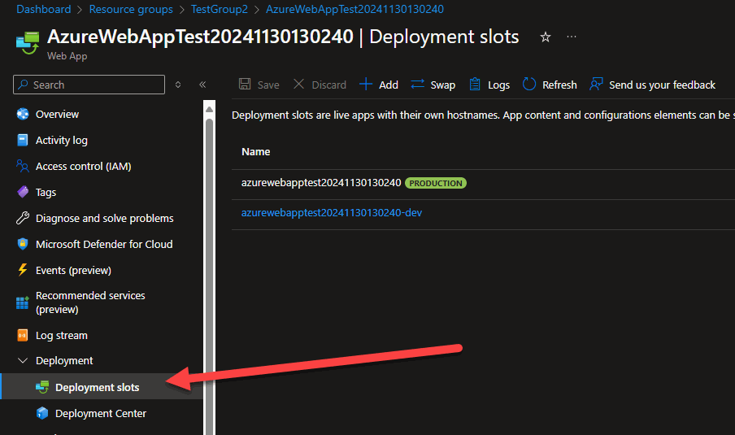
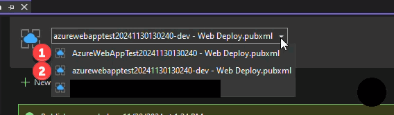
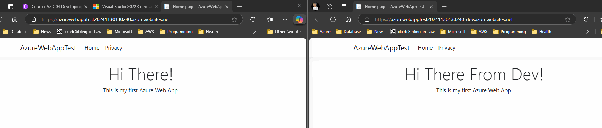

# Deployment Slots

Deployment Slots are used to push (or deploy) your code out to different environments.  For example

|#|Deployment Slot Name|Environment|
|-----|-----|-----|
|1|DEV_SLOT|DEV|
|2|UAT_SLOT|UAT|
|3|PROD_SLOT|PROD|

## Usage

### Steps

1. In the Azure Portal we we would go to our Web App and select Deployment Slots Option.
2. We would then add a deployment Slot in this case I added the one that ends with -dev
3. In visual  studio we woul select build >> publish >> then go to the option to use the deployment slot that we want to use.
4. Our finished product would look like the right side of the image in Screen Shot 3

Screen Shot 1

Screen Shot 2

Screen Shot 3

